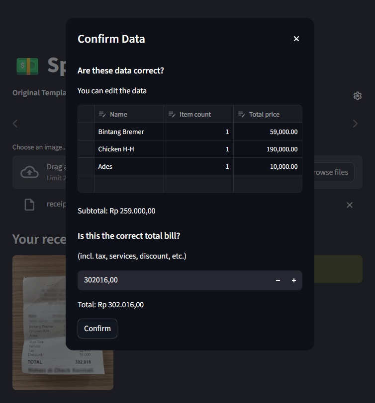
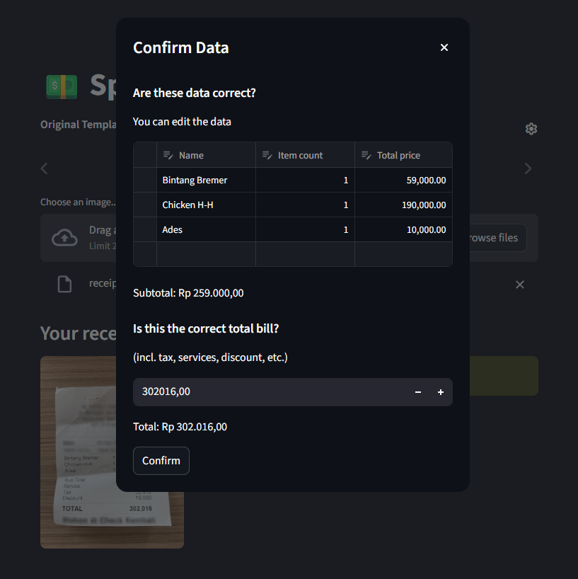
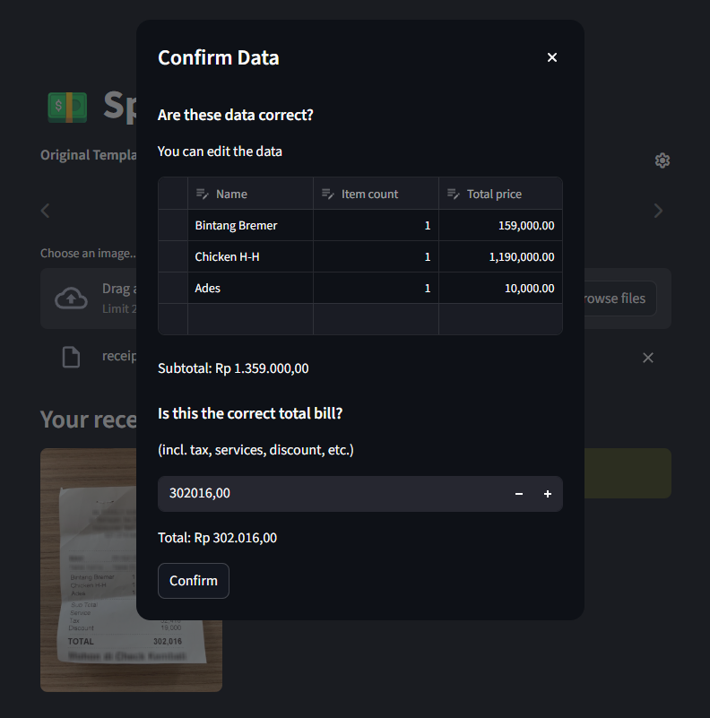
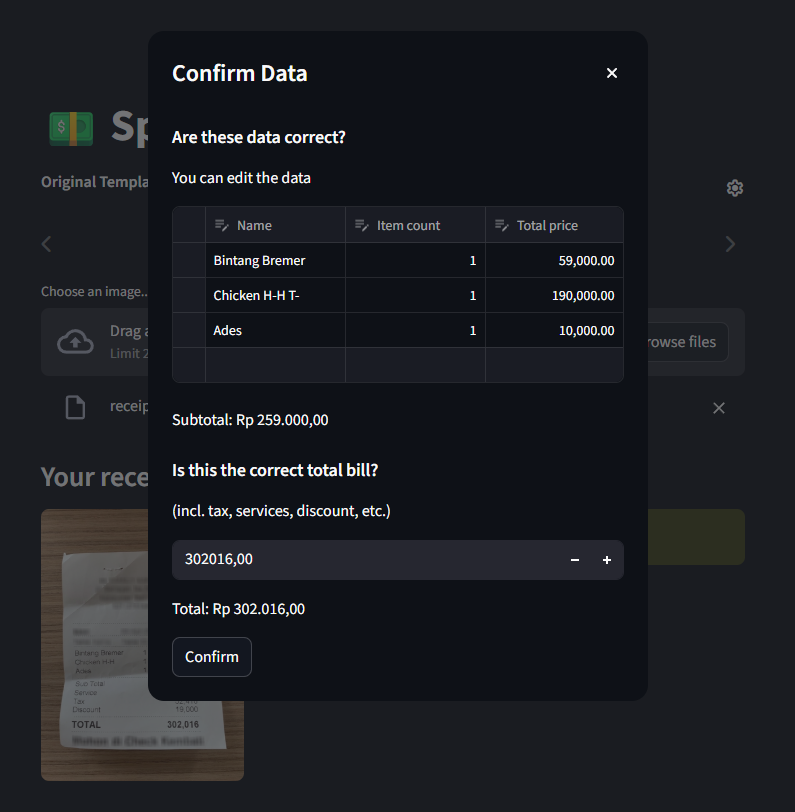
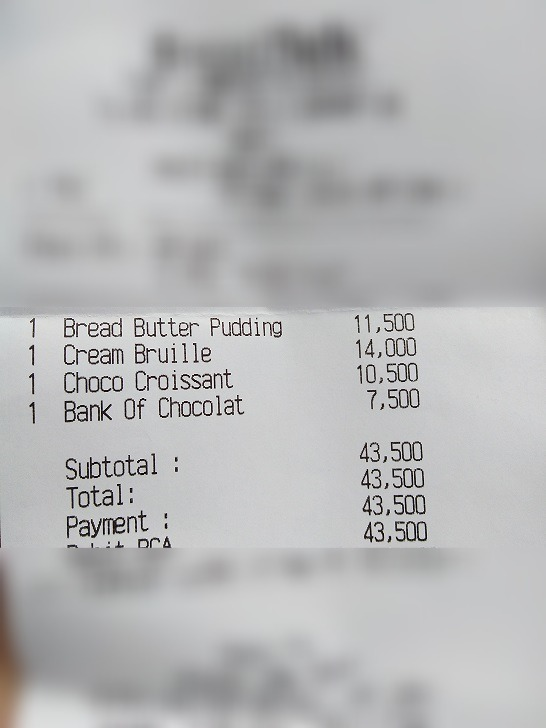
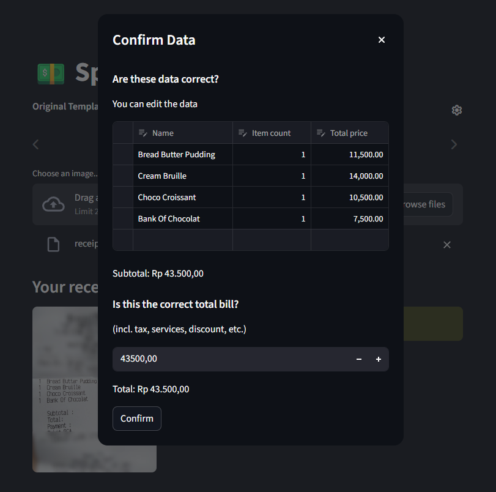
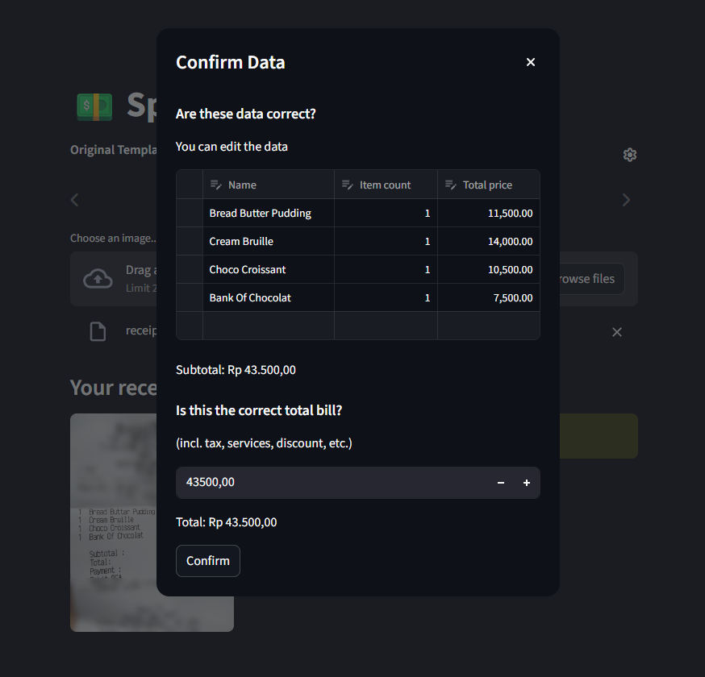
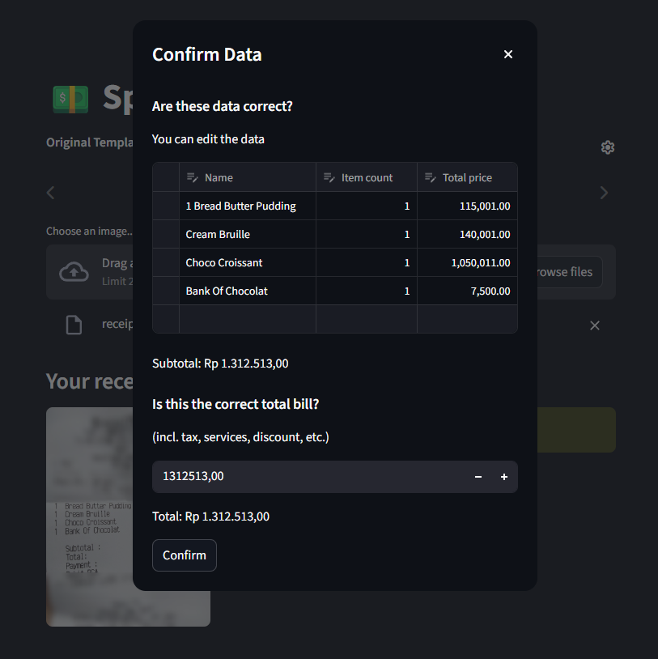
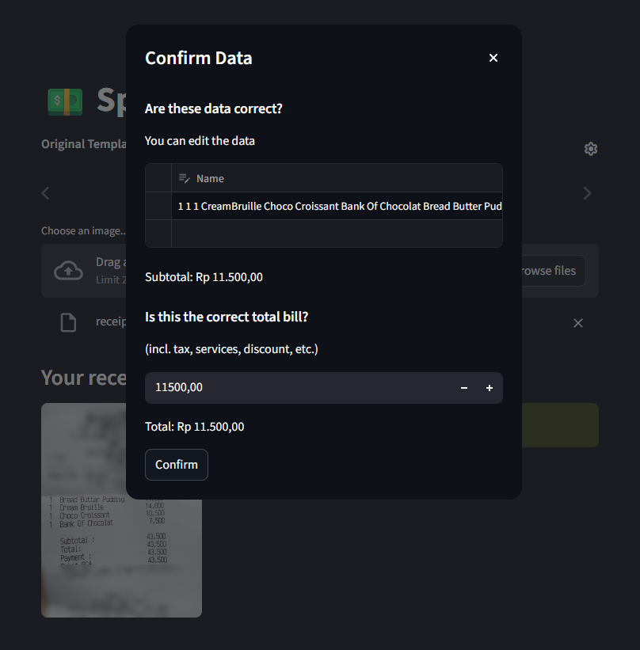

# Aplikasi Split Bill

Video demo singkat: https://youtu.be/h8hUedx-YhA

Repositori ini berisi aplikasi berbasis AI untuk membagi tagihan (*split-bill*), ditulis dalam bahasa Python (Streamlit) dan dapat dijalankan di komputer lokal Anda.

Atas izin dari: https://github.com/MukhlasAdib

## Fitur

Dengan aplikasi ini, Anda dapat mengunggah foto struk belanja Anda. AI akan membaca struk tersebut dan menampilkan datanya kepada Anda.


Kemudian, Anda dapat mendaftarkan peserta yang ikut dalam pembagian tagihan, lalu menetapkan item dari struk ke masing-masing peserta.


Setelah selesai, laporan akhir akan ditampilkan.


## Instalasi

1. Pastikan Python sudah terinstal (versi terbaru apa saja seharusnya bisa, saya mengujinya dengan Python 3.12).
2. Buat *environment* untuk aplikasi ini.

Menggunakan virtualenv:

```bash
    pip install virtualenv
    python -m virtualenv .venv
```
Menggunakan uv:

```bash
    uv sync
```

3. Aktifkan *environment* tersebut.

Jika menggunakan Linux:

```bash
    source .venv/bin/activate
```

Jika menggunakan Windows:

```powershell
    .\.venv\Scripts\activate
```

4. Instal library yang dibutuhkan.

Menggunakan virtualenv:

```bash
    pip install -r requirements.txt
```
Menggunakan uv:

```bash
    uv sync
```

## Menjalankan Aplikasi

1. Aktifkan *environment*.

Jika menggunakan Linux:

```bash
    source .venv/bin/activate
```

Jika menggunakan Windows:

```powershell
    .\.venv\Scripts\activate
```

2. Jalankan aplikasi.

Menggunakan virtualenv:

```bash
    streamlit run app.py
```

Menggunakan uv:

```bash
    uv run streamlit run app.py
```

## Pemilihan Model Alternatif

Model Gemini dan Donut telah diimplementasi pada aplikasi ini. Pada tugas ini, dua model alternatif diimplementasikan.

### 1. Microsoft Florence-2
*   Florence-2 adalah *Vision Foundation Model* terbaru (2024) dari Microsoft yang menggunakan pendekatan berbasis *prompt* (seperti `<OCR>`).
*   Model ini lebih ringan dibandingkan Donut, sehingga ideal untuk aplikasi lokal yang membutuhkan respon instan (1-2 detik).
*   Sangat baik dalam mengenali teks pada gambar berkualitas rendah karena kemampuannya dalam memprediksi urutan karakter secara cerdas.

### 2. PaddleOCR
*   Berbeda dengan model generatif, PaddleOCR menggunakan metode *pipeline* (Deteksi $\rightarrow$ Klasifikasi $\rightarrow$ Rekognisi), yang merupakan standar industri untuk akurasi teks mentah.
*   PaddleOCR bekerja berdasarkan koordinat *bounding box*. Hal ini mencegah error "penggabungan kolom" (seperti harga dan jumlah barang yang menyatu) yang sering terjadi pada model transformer seperti Florence atau Donut.
*   Sebagai model ekstraksi literal, PaddleOCR tidak berhalusinasi atau memperbaiki teks secara otomatis, sehingga lebih konsisten dalam membaca angka dan simbol mata uang yang presisi.

## Demo

Di bawah ini adalah dua contoh struk yang dibaca oleh aplikasi ini menggunakan empat model: Gemini, Donut, Florence, dan PaddleOCR.

### Struk 1


Hasil Gemini:



Hasil Donut:



Hasil Florence:



Hasil PaddleOCR:



### Struk 2



Hasil Gemini:



Hasil Donut:



Hasil Florence:



Hasil PaddleOCR:



## Evaluasi & Analisis

Evaluasi kualitatif terhadap model pembaca bill:

* **Akurasi**: Dalam hal akurasi bacaan, model Gemini dan model Donut memiliki akurasi yang paling tinggi (tidak ada kesalahan pada kedua sampel struk). Model PaddleOCR berada di posisi berikutnya. Pada struk 1, model mendeteksi lekukan kertas sebagai karakter "T-", sedangkan pada struk 2, model gagal mendeteksi item terakhir dan justru mendeteksi "Payment:" sebagai item. Model Florence berada di posisi terakhir. Pada struk 1, model mendeteksi angka kuantitas sebagai angka awal pada harga item serta keliru membaca subtotal, sedangkan pada struk 2, perbedaan struktur kolom pada struk membuat model mendeteksi angka kuantitas (1) sebagai digit harga, dan juga gagal mendeteksi total harga dengan tepat.

* **Kecepatan**: Pada aplikasi ini, model Donut, Gemini, dan PaddleOCR memiliki kecepatan yang relatif tinggi dan tidak jauh berbeda. Model Florence memiliki kecepatan inference yang paling lama dibandingkan ketiganya.

Evaluasi produk web secara keseluruhan:

* Secara keseluruhan, aplikasi menyajikan _user experience_ yang terasa baik, dengan alur unggah struk, koreksi tulisan, dan _splitting_ yang mudah diikuti dan intuitif.

* Ketika ingin mengganti model atau mengunggah foto struk lain, aplikasi terkadang terasa _buggy_, sehingga perlu dilakukan _refresh page_ setiap kali ingin melakukan perubahan model atau foto struk.

**Perbaikan**: Untuk _improvement_, beberapa hal dapat dilakukan:

* Tambahkan atau perbaiki proses _noise removal_ pada gambar struk yang diunggah supaya kerutan kertas, debu, atau _noise_ lainnya tidak akan terdeteksi oleh model yang lebih sensitif seperti PaddleOCR.

* Perbaiki _keyword filtering_ menjadi lebih ketat supaya tidak ada baris tulisan lain yang terdeteksi sebagai item.

* Tambahkan tahapan perbaikan orientasi dalam _preprocessing_ gambar struk supaya model mampu meng-_handle_ teks dari gambar struk yang tertekuk atau berposisi miring dengan tepat.

* Coba gunakan model LLM lokal seperti Qwen2-VL atau Llama 3.2 Vision yang memiliki kemampuan serupa dengan Gemini tanpa unggahan data ke server Google.
